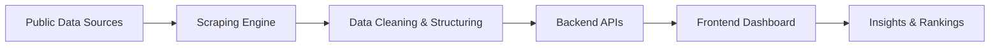

# 🚀 LokDrishti  
### 🧠 Know Before You Vote  

  

---

  
  
  
  

---

## 🌐 Live Demo  

🔗 **https://lokdrishti.online**

---

## 💡 The Idea  

> *If attendance matters in college, why not in Parliament?*

LokDrishti was built to answer one simple question:  
**How well are our elected representatives actually performing?**

---

## 🔥 What is LokDrishti?  

LokDrishti is an **AI-powered civic intelligence platform** that converts raw parliamentary data into **clear, actionable insights** for citizens.  

Instead of just showing information, it focuses on **performance, accountability, and transparency**.

---

## ⚡ Core Features  

### 📊 Performance Intelligence
- Attendance tracking  
- Questions asked  
- Debates participated  
- Data-driven evaluation  

---

### 🏆 Ranking System (LCI Score)
- MPs ranked nationally  
- Weighted performance scoring  
- Grade system (A–F)  
- Identify top & low performers  

---

### 🔍 Smart Search & Filtering
- Search by name, constituency, state, party  
- Advanced filters (performance, attendance, etc.)  
- Instant suggestions  

---

### 📈 Analytics Dashboard
- State-wise report cards  
- Party performance analysis  
- Inequality insights  
- Data visualization (radar, bar, distribution)  

---

### ⚔️ Comparison Engine
- Compare any two MPs  
- Highlight better performer  
- Side-by-side analysis  

---

### 🧾 Detailed MP Profiles
- Performance metrics  
- Criminal records  
- Key insights & tags  

---

## 🧠 How It Works  

🛠️ Tech Stack

  

📸 Product Preview

   

📁 Project Structure
frontend/        → Next.js UI  
backend/         → APIs & business logic  
scripts/         → scraping & data processing  
data/            → structured datasets  
⚙️ Installation
git clone https://github.com/PiyushLadukar/LokDrishti.git
cd LokDrishti
npm install
npm run dev
🚀 Vision

To make political data:

Transparent
Accessible
Actionable

and empower citizens to make informed voting decisions.

📊 Why LokDrishti Matters
Moves from information → insight
Promotes accountability in democracy
Bridges gap between citizens & governance
🚧 Roadmap
 MP Data & Profiles
 Performance Metrics
 Ranking System
 Analytics Dashboard
 Real-time data integration
 AI-based predictions
 Public contribution system
🤝 Contribution

Want to improve civic transparency?

Fork the repo
Create a branch
Make your changes
Submit a PR
🙌 Acknowledgement

Special thanks to Sachin Shukla for the idea, guidance, and continuous support.

📬 Connect
💼 GitHub: https://github.com/PiyushLadukar
🔗 LinkedIn: http://lokdrishti.online/

LokDrishti turns political data into citizen awareness.
Better awareness → Better decisions → Better democracy 🇮🇳